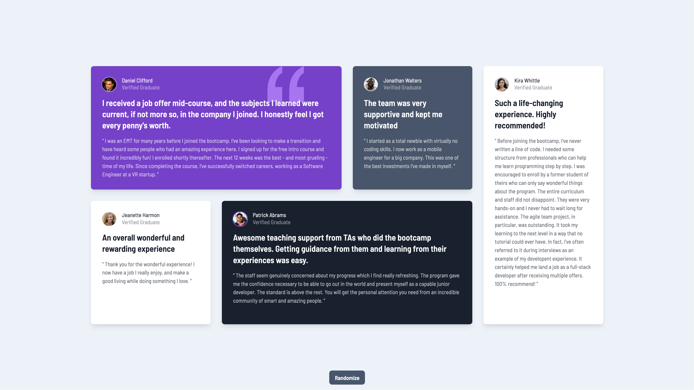

# Frontend Mentor - Testimonials grid section solution

This is a solution to the [Testimonials grid section challenge on Frontend Mentor](https://www.frontendmentor.io/challenges/testimonials-grid-section-Nnw6J7Un7). Frontend Mentor challenges help you improve your coding skills by building realistic projects.

## Table of contents

- [Overview](#overview)
  - [The challenge](#the-challenge)
  - [Screenshot](#screenshot)
  - [Links](#links)
- [My process](#my-process)
  - [Built with](#built-with)
  - [What I learned](#what-i-learned)
  - [Useful resources](#useful-resources)

## Overview

### The challenge

Users should be able to:

- View the optimal layout for the site depending on their device's screen size
- Randomize the placements of testimonials for fun.
- See the "scrollable" tag if the text overflows the container, and needs scrolling to view.

### Screenshot

### Links

- [Live Site URL](https://testimonials-grid-section.frilly.dev/)

## My process

### Built with

- [VueJS](https://vuejs.org/)
- [Tailwind CSS](https://tailwindcss.com/)
- [Astro](https://astro.build/)

### What I learned

- Named slots in VueJS are basically React's children but with a name, like multiple children.
- Checking for scrollable content can be done by comparing the `scrollHeight` and `clientHeight` of the element.

### Useful resources

- [Named Slots, Vue](https://vuejs.org/guide/components/slots.html)
